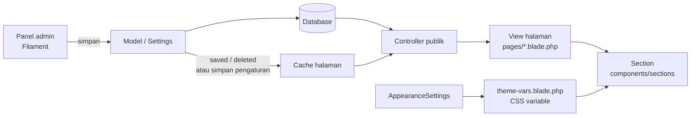

# Arsitektur Project

**Terakhir diperbarui**: 2026-09-26

Dokumen ini untuk developer yang baru bergabung, atau yang baru meng-clone Web Solarpanel Kit (Simetri) untuk klien baru. Baca dokumen ini lebih dulu sebelum mengubah kode: isinya peta lapisan, lokasi tiap jenis kode, alur data dari panel admin ke halaman publik, dan konvensi yang wajib diikuti. Dokumen ini tidak mengajarkan dasar Laravel atau Filament, hanya cara project ini memakainya.

Untuk tugas spesifik, lanjut ke:

- [Panduan menambah section](panduan-section.md)
- [Panduan tema](panduan-tema.md)

## Gambaran umum

Simetri adalah starter kit **company profile** yang di-clone ke banyak klien. Setiap fitur harus config-driven, bukan hardcode per klien.

| Komponen | Versi |
|---|---|
| PHP | 8.3 |
| Laravel | 13 |
| Filament (panel admin) | 3.3 |
| Livewire | 3.8 |
| Spatie Laravel Settings | 3.9 |
| Filament Shield (role & permission) | 3.9 |
| Tailwind CSS | 4 (CSS-first, blok `@theme` di `resources/css/app.css`, tanpa file konfigurasi Tailwind) |
| Vite | 8 |

Lima prinsip dari [constitution](../.specify/memory/constitution.md) yang membatasi cara kerja di project ini:

1. **Multi-Client Reusability**: data klien hidup di settings, seeder, atau `.env`, bukan di view atau logika bisnis.
2. **White-Label by Default**: nama, logo, favicon, dan warna bisa diganti lewat pengaturan; tidak ada branding starter kit yang terlihat oleh pengunjung.
3. **Settings-Driven Theming, No Page Builder** (tidak boleh dilanggar): tema lewat Spatie Settings + CSS variable + section Blade bernama. Page builder di luar scope.
4. **Module Test Coverage**: setiap modul konten wajib punya feature test dasar.
5. **Simplicity & Dependency Discipline**: pilih paket Spatie/Filament resmi, hindari abstraksi spekulatif, audit lisensi sebelum rilis v1.0.

Pelacakan pekerjaan dilakukan di Linear (tim Amaya ECOM, project Web Solarpanel Kit, key `AMC`). Constitution masih menyebut Jira `SIM`; abaikan, itu sisa dari sebelum pindah tracker.

## Lapisan & alur data

Alur untuk konten (misal banner):

1. Admin menyimpan data lewat resource atau halaman pengaturan di `app/Filament/`.
2. Data masuk ke database lewat model di `app/Models/` (konten berdaftar) atau kelas Settings di `app/Settings/` (pengaturan situs).
3. Controller publik di `app/Http/Controllers/Public/` membaca data dan mengirimnya ke view. Controller memakai trait `app/Concerns/CachesPublicPages.php`, yang menyimpan hasil query di cache.
4. View di `resources/views/pages/` (memakai `resources/views/layouts/public.blade.php`) merangkai section dari `resources/views/components/sections/`.

Alur untuk tema: admin mengubah halaman **Tampilan** → `app/Settings/AppearanceSettings.php` → `resources/views/layouts/partials/theme-vars.blade.php` menulis CSS variable per request → class Tailwind di section mengikuti. Rinciannya ada di [panduan tema](panduan-tema.md).

### Cache halaman publik

- Trait `app/Concerns/CachesPublicPages.php` menyimpan hasil query controller selama **5 menit** dengan key `public-page:{nama-halaman}`, misal `public-page:home`, `public-page:tentang-kami`, `public-page:produk.index`, `public-page:produk.show:{slug}`.
- Cache hanya dipakai controller publik. Panel admin tidak pernah membaca dari cache ini, jadi admin selalu melihat data terbaru.
- **Invalidasi** ada dua pola, dan tidak semua modul memakainya:
  - Hook `saved`/`deleted` di model, contoh `app/Models/Banner.php` (menghapus `public-page:home`).
  - Menghapus key saat halaman pengaturan disimpan, contoh `app/Filament/Pages/AboutPageSettingsPage.php` (menghapus `public-page:tentang-kami`).
- Modul tanpa invalidasi (produk, artikel, portfolio, FAQ) mengandalkan TTL: perubahan admin bisa butuh sampai 5 menit untuk tampil di halaman publik.
- Data kalkulator punya cache sendiri di `app/Models/ElectricityAppliance.php` (key `electricity-appliances:active`, dihapus otomatis saat data berubah).

### SEO & sitemap

- Trait `app/Concerns/HasSeoMetadata.php` dan helper di `app/Support/Seo/` (judul halaman dan JSON-LD) dipakai model/controller yang punya field SEO.
- Pengaturan SEO global ada di `app/Settings/SeoSettings.php`, dipakai `resources/views/layouts/public.blade.php` dan partial di `resources/views/layouts/partials/`.
- Sitemap dan robots.txt dinamis ditangani `app/Http/Controllers/Public/SitemapController.php` (route `/sitemap.xml` dan `/robots.txt` di `routes/web.php`).

## Peta direktori

| Lokasi | Fungsi | Contoh |
|---|---|---|
| `app/Filament/Resources/` | Resource admin (CRUD) per modul konten | `app/Filament/Resources/TestimonialResource.php` |
| `app/Filament/Pages/` | Halaman admin khusus: pengaturan situs dan Dashboard | `app/Filament/Pages/AppearanceSettingsPage.php` |
| `app/Providers/Filament/` | Konfigurasi panel admin: plugin, urutan grup navigasi | `app/Providers/Filament/AdminPanelProvider.php` |
| `app/Settings/` | Kelas Spatie Settings (pengaturan situs) | `app/Settings/SiteSettings.php` |
| `app/Models/` | Model Eloquent modul konten | `app/Models/Product.php` |
| `app/Http/Controllers/Public/` | Controller halaman publik, satu per halaman | `app/Http/Controllers/Public/HomeController.php` |
| `app/Concerns/` | Trait bersama (cache halaman, SEO) | `app/Concerns/CachesPublicPages.php` |
| `app/Services/` | Logika bisnis yang bukan milik satu model | `app/Services/SavingsEstimator.php` |
| `app/Support/` | Helper kecil (gambar, sanitasi HTML, SEO) | `app/Support/ImageUploads.php` |
| `app/Enums/` | Enum untuk pilihan tetap | `app/Enums/BannerOverlayStyle.php` |
| `app/Mail/`, `app/Notifications/` | Email terima kasih dan notifikasi admin (kontak, kalkulator) | `app/Notifications/NewContactSubmission.php` |
| `app/Policies/` | Policy untuk role dan media | `app/Policies/RolePolicy.php` |
| `app/Console/Commands/` | Perintah artisan setup klien dan data demo | `app/Console/Commands/SetupClientCommand.php` |
| `database/migrations/` | Skema tabel | `database/migrations/2026_09_06_222938_create_testimonials_table.php` |
| `database/settings/` | Migrasi nilai default Spatie Settings | `database/settings/2026_09_23_100000_create_site_settings.php` |
| `database/seeders/` | Seeder data awal dan data demo | `database/seeders/DemoContentSeeder.php` |
| `routes/web.php` | Route halaman publik | `routes/web.php` |
| `resources/views/pages/` | Halaman publik (extend layout publik) | `resources/views/pages/home.blade.php` |
| `resources/views/components/sections/` | Section yang dirangkai halaman | `resources/views/components/sections/hero.blade.php` |
| `resources/views/components/layout/` | Header, footer, menu, cookie consent | `resources/views/components/layout/header.blade.php` |
| `resources/views/layouts/` | Layout publik dan partial head (tema, OG, JSON-LD) | `resources/views/layouts/public.blade.php` |
| `resources/css/app.css` | Token desain Tailwind dan fallback CSS variable | `resources/css/app.css` |
| `tests/Feature/` | Feature test per area: `Admin`, `Public`, `Pages`, `Settings`, `Console`, `Database`, `Dashboard`, `ActivityLog`, `Docs` | `tests/Feature/Pages/HomePageTest.php` |
| `specs/` | Spec, plan, dan tasks per fitur (alur spec-kit) | `specs/025-technical-docs/plan.md` |
| `docs/` | Dokumentasi operasional dan developer | `docs/deployment.md` |

## Daftar modul konten

Semua modul di bawah punya resource admin kecuali FAQ (data diisi lewat seeder).

| Modul | Model | Resource admin | Tampilan publik | Test | Invalidasi cache |
|---|---|---|---|---|---|
| Produk & Kategori | `app/Models/Product.php`, `app/Models/Category.php` | `app/Filament/Resources/ProductResource.php`, `app/Filament/Resources/CategoryResource.php` | `resources/views/pages/produk/index.blade.php`, `resources/views/components/sections/product-card.blade.php` | `tests/Feature/Admin/ProductResourceTest.php`, `tests/Feature/Pages/ProductPageTest.php` | Tidak ada (TTL) |
| Artikel & Kategori | `app/Models/Article.php`, `app/Models/ArticleCategory.php` | `app/Filament/Resources/ArticleResource.php`, `app/Filament/Resources/ArticleCategoryResource.php` | `resources/views/pages/artikel/index.blade.php`, `resources/views/components/sections/article-card.blade.php` | `tests/Feature/Admin/ArticleResourceTest.php`, `tests/Feature/Pages/ArticlePageTest.php` | Tidak ada (TTL) |
| Portfolio & Kategori | `app/Models/PortfolioProject.php`, `app/Models/PortfolioCategory.php` | `app/Filament/Resources/PortfolioProjectResource.php`, `app/Filament/Resources/PortfolioCategoryResource.php` | `resources/views/pages/portfolio/index.blade.php` | `tests/Feature/Admin/PortfolioProjectResourceTest.php`, `tests/Feature/Pages/PortfolioPageTest.php` | Tidak ada (TTL) |
| Team Members | `app/Models/TeamMember.php` | `app/Filament/Resources/TeamMemberResource.php` | `resources/views/components/sections/team-members.blade.php` di `resources/views/pages/tentang-kami.blade.php` | `tests/Feature/Admin/TeamMemberResourceTest.php`, `tests/Feature/Pages/AboutPageTeamMembersTest.php` | `public-page:tentang-kami` |
| Testimonials | `app/Models/Testimonial.php` | `app/Filament/Resources/TestimonialResource.php` | `resources/views/components/sections/testimonials.blade.php` di Home dan Tentang Kami | `tests/Feature/Admin/TestimonialResourceTest.php`, `tests/Feature/Pages/AboutPageTestimonialsTest.php` | `public-page:tentang-kami` (lihat [hal yang perlu diperhatikan](#hal-yang-perlu-diperhatikan)) |
| Client Logos | `app/Models/ClientLogo.php` | `app/Filament/Resources/ClientLogoResource.php` | `resources/views/components/sections/client-logos.blade.php` | `tests/Feature/Admin/ClientLogoResourceTest.php`, `tests/Feature/Pages/AboutPageClientLogosTest.php` | `public-page:tentang-kami` |
| Banner (hero slider) | `app/Models/Banner.php` | `app/Filament/Resources/BannerResource.php` | `resources/views/components/sections/hero-slider.blade.php` di Home | `tests/Feature/Admin/BannerResourceTest.php`, `tests/Feature/Pages/HomeBannerTest.php` | `public-page:home` |
| Karir | `app/Models/JobOpening.php` | `app/Filament/Resources/JobOpeningResource.php` | `resources/views/pages/karir.blade.php`, `resources/views/components/sections/job-card.blade.php` | `tests/Feature/Admin/JobOpeningResourceTest.php`, `tests/Feature/Pages/CareerPageTest.php`, `tests/Feature/Public/CareerModuleToggleTest.php` | Tidak ada |
| Custom Page | `app/Models/CustomPage.php` | `app/Filament/Resources/CustomPageResource.php` | `resources/views/pages/custom-page/show.blade.php` (route `/halaman/{slug}`) | `tests/Feature/Admin/CustomPageResourceTest.php`, `tests/Feature/Pages/CustomPagePageTest.php` | Tidak ada |
| FAQ | `app/Models/FaqItem.php` | Tidak ada (seeder: `database/seeders/FaqItemSeeder.php`) | `resources/views/pages/faq.blade.php` | `tests/Feature/Pages/FaqPageTest.php` | Tidak ada (TTL) |
| Menu Builder | `app/Models/MenuLocation.php`, `app/Models/MenuItem.php` | `app/Filament/Resources/MenuLocationResource.php`, `app/Filament/Resources/MenuItemResource.php` | `resources/views/components/layout/menu.blade.php`, `resources/views/components/layout/header.blade.php`, `resources/views/components/layout/footer.blade.php` | `tests/Feature/Admin/MenuItemResourceTest.php`, `tests/Feature/Public/MenuRenderingTest.php` | Tidak ada |
| Kontak | `app/Models/ContactSubmission.php` | `app/Filament/Resources/ContactSubmissionResource.php` | `resources/views/pages/kontak.blade.php` | `tests/Feature/Admin/ContactSubmissionResourceTest.php`, `tests/Feature/Pages/ContactPageTest.php` | Tidak ada (form, bukan konten) |
| Kalkulator | `app/Models/CalculatorLead.php`, `app/Models/ElectricityAppliance.php` | `app/Filament/Resources/CalculatorLeadResource.php`, `app/Filament/Resources/ElectricityApplianceResource.php` | `resources/views/components/sections/calculator.blade.php` | `tests/Feature/Public/CalculatorLeadTest.php`, `tests/Feature/Admin/ElectricityApplianceResourceTest.php` | `electricity-appliances:active` (otomatis) |

Modul pendukung di panel admin: Pengguna (`app/Filament/Resources/UserResource.php`), Roles (`app/Filament/Resources/RoleResource.php`, dari Filament Shield), dan Log Aktivitas (plugin di `app/Providers/Filament/AdminPanelProvider.php`), semuanya di grup **Sistem**.

## Pengaturan situs

Pengaturan situs adalah data tunggal per instalasi (bukan daftar item). Tiap kelas di `app/Settings/` punya satu halaman admin di grup **Pengaturan Situs** (kecuali Halaman Tentang Kami yang berada di grup Konten Halaman).

| Kelas | Halaman admin (label menu) | Dipakai di |
|---|---|---|
| `app/Settings/SiteSettings.php` | `app/Filament/Pages/SiteSettingsPage.php` (Pengaturan Umum) | Header, footer, halaman publik (kontak, karir, FAQ, dst.), email, halaman error, dan mode pemeliharaan (identitas, kontak, legal, toggle modul karir) |
| `app/Settings/AppearanceSettings.php` | `app/Filament/Pages/AppearanceSettingsPage.php` (Tampilan) | `resources/views/layouts/partials/theme-vars.blade.php`, layout publik |
| `app/Settings/SeoSettings.php` | `app/Filament/Pages/SeoSettingsPage.php` (SEO) | `resources/views/layouts/public.blade.php`, sitemap/robots |
| `app/Settings/SocialSettings.php` | `app/Filament/Pages/SocialSettingsPage.php` (Media Sosial) | `resources/views/components/layout/header.blade.php`, `resources/views/components/layout/social-share.blade.php`, `resources/views/layouts/partials/og-meta.blade.php`, `app/Support/Seo/JsonLd.php` |
| `app/Settings/ScriptSettings.php` | `app/Filament/Pages/ScriptSettingsPage.php` (Scripts & Analytics) | `resources/views/layouts/public.blade.php`, `resources/views/components/layout/gated-script.blade.php` |
| `app/Settings/CalculatorSettings.php` | `app/Filament/Pages/CalculatorSettingsPage.php` (Kalkulator Estimasi) | `app/Services/SavingsEstimator.php` |
| `app/Settings/AboutPageSettings.php` | `app/Filament/Pages/AboutPageSettingsPage.php` (Halaman Tentang Kami) | `resources/views/pages/tentang-kami.blade.php` |

Menambah atau mengubah properti sebuah kelas Settings selalu butuh migrasi baru di `database/settings/` (mengikuti pola file di folder tersebut), lalu `php artisan migrate`.

## Konvensi

- **Bahasa**: label, judul, dan pesan di panel admin memakai Bahasa Indonesia. Nama route publik juga Indonesia (`produk.index`, `tentang-kami`, `kontak`), dan custom page ada di bawah prefix `/halaman/` supaya tidak bentrok dengan route statis (`routes/web.php`).
- **Grup navigasi admin**: didefinisikan berurutan di `app/Providers/Filament/AdminPanelProvider.php`: Konten Halaman, Katalog, Prospek & Pesan, Blog, Portfolio, Karir, Menu Builder, Pengaturan Situs, Sistem. Resource baru harus masuk ke salah satu grup ini lewat `$navigationGroup`, bukan membuat grup baru tanpa alasan. Tes struktur navigasi ada di `tests/Feature/Admin/NavigationStructureTest.php`.
- **Test**: setiap modul konten wajib punya feature test dasar (CRUD admin dan render publik) sebelum dianggap selesai. Gunakan PHPUnit (bukan Pest) dan factory model.
- **Format kode**: jalankan `vendor/bin/pint --dirty --format agent` sebelum commit.
- **White-label**: jangan menulis data klien (nama, alamat, warna, font) di view atau logika. `tests/Feature/Public/NoHardcodedClientDataTest.php` memeriksa instalasi bersih tidak menampilkan data klien tertentu.
- **Data klien vs data demo**: seeder demo (`database/seeders/DemoContentSeeder.php`) hanya untuk showcase penjualan dan tidak boleh berjalan otomatis di produksi.
- **Alur fitur**: fitur besar dikerjakan lewat spec-kit, hasilnya tersimpan di `specs/NNN-nama-fitur/` (spec, plan, tasks).

## Hal yang perlu diperhatikan

- **Cache testimoni di Home**: `app/Models/Testimonial.php` hanya menghapus key `public-page:tentang-kami`, padahal `app/Http/Controllers/Public/HomeController.php` juga menampilkan testimoni dengan key `public-page:home`. Perubahan testimoni bisa terlambat tampil di Home sampai 5 menit. Belum diperbaiki.
- **Aturan umum cache**: setiap data baru yang tampil di halaman yang di-cache harus menghapus key halaman itu saat berubah, atau pengunjung akan melihat data lama sampai TTL habis.
- **Pemilih varian section belum ada** (AMC-221 ditunda) dan **live preview tema belum ada** (AMC-222 ditunda). Lihat batasannya di [panduan section](panduan-section.md) dan [panduan tema](panduan-tema.md).

## Dokumen terkait

- [Panduan menambah section](panduan-section.md)
- [Panduan tema](panduan-tema.md)
- [Panduan deployment](deployment.md)
- [Strategi versioning lintas klien](versioning-strategi-klien.md)
- [Checklist setup Google Analytics](checklist-ga4-setup.md)
- [Checklist go-live](checklist-go-live.md)
